# LLM Latency Benchmarking: Prefill, Decode, TTFT, and Token Throughput

This project measures real local LLM inference latency through a streaming API and breaks latency into practical components that matter for production systems.

It captures:

- TTFT
- prefill time
- decode wall time
- decode model time
- total latency
- output tokens per second
- percentile metrics such as p50, p90, p95, and p99

The repository started as part of a Week 2 LLM Infrastructure learning journey covering tokenization, context windows, prompt packing, prefill, and decode. It now extends that work into real local inference benchmarking with Ollama-served models such as `qwen3:4b`, `mistral:instruct`, and `gemma3:4b`.

## Why this project matters

LLM inference optimization is not just about getting a response eventually. Users care about how quickly the first token appears and how steadily the rest of the output arrives. Those two phases are often influenced by different factors.

- Long prompts increase prefill cost because the model must process more input tokens before generation begins.
- Long outputs increase decode time because the model must generate more tokens step by step.
- Average latency alone is not enough because production systems are often constrained by slow outliers.
- Percentiles such as p95 and p99 help reveal tail-latency behavior that averages can hide.
- Benchmarking makes it easier to compare models, prompt sizes, and serving setups under controlled settings.

## Architecture

```mermaid
flowchart LR
    A[Prompt Input<br/>examples/full_prompt_example.txt] --> B[Benchmark Script<br/>week2_LLM_Inference/src/ollama_real_benchmark.py]
    B --> C[CLI Configuration<br/>model names<br/>API URL<br/>output tokens<br/>warmup runs<br/>measured runs<br/>temperature]
    C --> D[Local LLM Server<br/>Ollama Streaming API<br/>qwen3:4b / mistral / gemma]
    D --> E[Streaming JSON Response<br/>token chunks<br/>final metadata chunk]
    E --> F[Per-run Metrics Capture<br/>TTFT<br/>prompt tokens<br/>generated tokens<br/>prefill seconds<br/>decode wall seconds<br/>decode model seconds<br/>total latency<br/>tokens per second]
    F --> G[Warmup Filtering<br/>ignore warmup runs<br/>keep measured runs]
    G --> H[Aggregation Layer<br/>average<br/>p50 / p90 / p95 / p99]
    H --> I[Benchmark Outputs<br/>real_benchmark_runs.csv<br/>real_benchmark_summary.csv<br/>real_benchmark_summary.json<br/>benchmark_runs/tagged archives]
    I --> J[Inference Insights<br/>prefill cost<br/>decode cost<br/>tail latency<br/>token throughput<br/>serving behavior]
```



The flow is straightforward. A prompt is loaded from disk, the benchmark script sends a streaming generation request to a local Ollama-style API, and per-run timings are captured from both the client side and model-reported metadata. Warmup runs are excluded from analysis, measured runs are aggregated into summary statistics, and the resulting CSV and JSON outputs are used to reason about inference performance.

## Core concepts

### Tokenization

Tokenization is the process of converting raw text into model-readable token IDs. Token count matters because models operate on tokens, not words, and different tokenizers can split the same text differently.

### Context window

A context window is the maximum number of tokens a model can process in one request. It includes the input prompt and, in practical settings, the space you want to reserve for output tokens.

### Prompt token count

Prompt token count is the number of input tokens the model must process before it can start generation. This value strongly influences prefill cost.

### Prefill

Prefill is the model's input-processing phase. During prefill, the model consumes the prompt and prepares internal state for generation. Longer prompts generally increase prefill latency.

### TTFT

TTFT, or time to first token, measures how long it takes from the request start until the first generated token appears. It is one of the most user-visible latency metrics.

### Decode

Decode is the output-generation phase where the model generates tokens one step at a time after prefill has completed.

### Decode wall time

Decode wall time is the client-observed time between the first streamed token and the completion of the response.

### Decode model time

Decode model time is the model-runtime-reported generation time when the API exposes it. This is useful because it helps separate model compute from client-side overhead.

### Total latency

Total latency is the full request time from request start to response completion.

### Output tokens per second

Output tokens per second measures generation throughput during decode. It helps compare how quickly a serving stack can emit model output.

### p50, p90, p95, p99

These are percentile metrics:

- p50 is the median
- p90 shows the value below which 90% of runs fall
- p95 highlights slower tail behavior
- p99 exposes more extreme latency outliers

For systems work, these are often more informative than a simple average.

## Latency formulas

```text
TTFT = first_token_time - request_start_time

Decode wall time = response_complete_time - first_token_time

Total latency = response_complete_time - request_start_time

Total latency ≈ TTFT + decode wall time

Output tokens/sec = generated_token_count / decode_model_seconds
```

Also:

```text
Prefill = model input-processing phase
Decode = model output-generation phase
```

Important note:

```text
decode_wall_seconds is measured from the client side.
decode_model_seconds is reported by the model runtime/API when available.
```

## Features

- Streaming benchmark using a local Ollama-style LLM API
- Warmup runs to stabilize measurements
- Measured benchmark runs for aggregation
- Raw per-run CSV output
- Aggregated summary CSV and JSON output
- Percentile latency metrics
- Tagged archive outputs for repeatable reruns
- Real local measurements rather than simulated latency
- Support for multiple local models in one benchmark session
- Simple CLI configuration for prompt file, output length, temperature, and run counts

## Repository structure

```text
LLM_Inference_cost_Latency_analyser/
├── README.md
├── week2_LLM_Inference/
│   ├── README.md
│   ├── requirements.txt
│   ├── examples/
│   │   ├── context_examples.json
│   │   ├── full_prompt_example.txt
│   │   ├── prompt_sections.json
│   │   ├── sample_texts.txt
│   │   └── tokenization_cases.json
│   ├── notebooks/
│   │   ├── 01_tokenizer_setup.ipynb
│   │   ├── 02_tokenization_behavior_lab.ipynb
│   │   ├── 03_context_window_calculator.ipynb
│   │   ├── 04_prompt_packing_truncation.ipynb
│   │   ├── 05_prefill_estimator.ipynb
│   │   ├── 06_decode_estimator.ipynb
│   │   └── 07_full_inference_analyzer.ipynb
│   ├── outputs/
│   │   ├── real_benchmark_runs.csv
│   │   ├── real_benchmark_summary.csv
│   │   ├── real_benchmark_summary.json
│   │   ├── benchmark_runs/
│   │   └── figures/
│   └── src/
│       ├── tokenizer_utils.py
│       ├── context_analyzer.py
│       ├── prompt_packer.py
│       ├── prefill_estimator.py
│       ├── decode_estimator.py
│       ├── inference_analyzer.py
│       └── ollama_real_benchmark.py
```

## Setup instructions

Create and activate a local virtual environment:

```bash
cd week2_LLM_Inference
python3 -m venv week2_llm_inf
source week2_llm_inf/bin/activate
pip install -r requirements.txt
```

The local LLM server must be running before the benchmark starts. For an Ollama-style setup:

```bash
ollama serve
ollama pull qwen3:4b
ollama pull mistral:instruct
ollama pull gemma3:4b
```

## How to run

Run the real benchmark from the repository root:

```bash
week2_LLM_Inference/week2_llm_inf/bin/python week2_LLM_Inference/src/ollama_real_benchmark.py \
  --prompt-file week2_LLM_Inference/examples/full_prompt_example.txt \
  --models qwen3:4b mistral:instruct gemma3:4b \
  --num-predict 512 \
  --num-runs 50 \
  --warmup-runs 3 \
  --temperature 0 \
  --output-tag week2_final_512tok
```

Example with a single model:

```bash
week2_LLM_Inference/week2_llm_inf/bin/python week2_LLM_Inference/src/ollama_real_benchmark.py \
  --prompt-file week2_LLM_Inference/examples/full_prompt_example.txt \
  --models qwen3:4b \
  --num-predict 128 \
  --num-runs 30 \
  --warmup-runs 5 \
  --temperature 0 \
  --output-tag qwen_short_run
```

## Input prompt

The current real benchmark uses:

- `week2_LLM_Inference/examples/full_prompt_example.txt`

This prompt is useful for end-to-end latency measurement because it is large enough to expose non-trivial prefill cost while still being practical for repeated local benchmarking.

The repository also includes other example files used in the earlier Week 2 learning steps for tokenization, context-window analysis, and prompt packing.

## Output files

The real benchmark currently writes:

- `week2_LLM_Inference/outputs/real_benchmark_runs.csv`
  Raw per-run measurements for each model and run index.
- `week2_LLM_Inference/outputs/real_benchmark_summary.csv`
  Aggregated summary metrics across measured runs.
- `week2_LLM_Inference/outputs/real_benchmark_summary.json`
  JSON version of the summary for downstream use.
- `week2_LLM_Inference/outputs/benchmark_runs/<tag>/`
  Archived copies of run outputs for tagged benchmark sessions.

The broader Week 2 project also contains CSV reports and figures from the simulation and analysis steps in:

- `week2_LLM_Inference/outputs/`
- `week2_LLM_Inference/outputs/figures/`

## Metrics captured per run

| Metric | Meaning |
| --- | --- |
| `model_name` | Name of the model being benchmarked |
| `run_index` | Run number for the benchmark |
| `prompt_token_count` | Number of input tokens processed by the model |
| `generated_token_count` | Number of output tokens generated by the model |
| `ttft_seconds` | Time from request start to first output token |
| `prefill_seconds` | Model-reported input-processing time, if available |
| `decode_wall_seconds` | Client-side time from first token to response completion |
| `decode_model_seconds` | Model-reported output generation time, if available |
| `total_latency_seconds` | Full request time from start to completion |
| `output_tokens_per_second` | Output generation speed |

## Summary metrics

| Metric | Meaning |
| --- | --- |
| `avg_ttft_seconds` | Average time to first token |
| `p50_ttft_seconds` | Median TTFT |
| `p90_ttft_seconds` | TTFT at the 90th percentile |
| `p95_ttft_seconds` | TTFT at the 95th percentile |
| `p99_ttft_seconds` | TTFT at the 99th percentile |
| `avg_decode_wall_seconds` | Average client-observed decode time |
| `p50_decode_wall_seconds` | Median decode wall time |
| `p90_decode_wall_seconds` | Decode wall time at the 90th percentile |
| `p95_decode_wall_seconds` | Decode wall time at the 95th percentile |
| `p99_decode_wall_seconds` | Decode wall time at the 99th percentile |
| `avg_total_latency_seconds` | Average full request latency |
| `p50_total_latency_seconds` | Median total latency |
| `p90_total_latency_seconds` | Total latency at the 90th percentile |
| `p95_total_latency_seconds` | Total latency at the 95th percentile |
| `p99_total_latency_seconds` | Total latency at the 99th percentile |
| `avg_prefill_seconds` | Average model-reported prompt processing time |
| `avg_decode_model_seconds` | Average model-reported generation time |
| `avg_output_tokens_per_second` | Average output generation speed |

Note: if your existing summary CSV or JSON was generated before `p90` support was added, rerun the benchmark to populate the new `p90` fields.

## Example interpretation

If `avg_prefill_seconds` is low but `avg_decode_wall_seconds` is high, the prompt is probably not the main bottleneck. The output-generation phase is dominating total latency.

If `p95` or `p99` latency is much higher than average latency, the system has tail-latency issues. That often means occasional slow runs are affecting user experience even when the average looks acceptable.

If `decode_wall_seconds` and `decode_model_seconds` are very close, most decode latency is coming from model generation rather than client-side streaming overhead.

## Benchmarking best practices

- Use warmup runs before measured runs.
- Use at least 30 measured runs for basic percentile stability.
- Use 50 to 100 runs for stronger `p95` and `p99` signals.
- Keep temperature fixed.
- Keep output token count fixed when comparing models.
- Keep prompts consistent when comparing models or serving setups.
- Benchmark when the machine is not under heavy load.
- Do not compare models unless hardware and generation settings are kept consistent.


This repository includes both simulated and real measurement work.

- `prefill_estimator.py`, `decode_estimator.py`, and `inference_analyzer.py` are estimation and analysis tools
- `ollama_real_benchmark.py` performs actual local runtime measurement

That distinction matters. The earlier tools build intuition; the real benchmark measures actual serving behavior on the local machine.

## What I learned

- TTFT explains how quickly the user sees the first token.
- Prefill depends mainly on input prompt length.
- Decode depends mainly on generated output length.
- Total latency combines first-token delay and generation time.
- Percentile metrics are more useful than averages for production systems.
- LLM inference optimization requires separating input-processing cost from output-generation cost.
